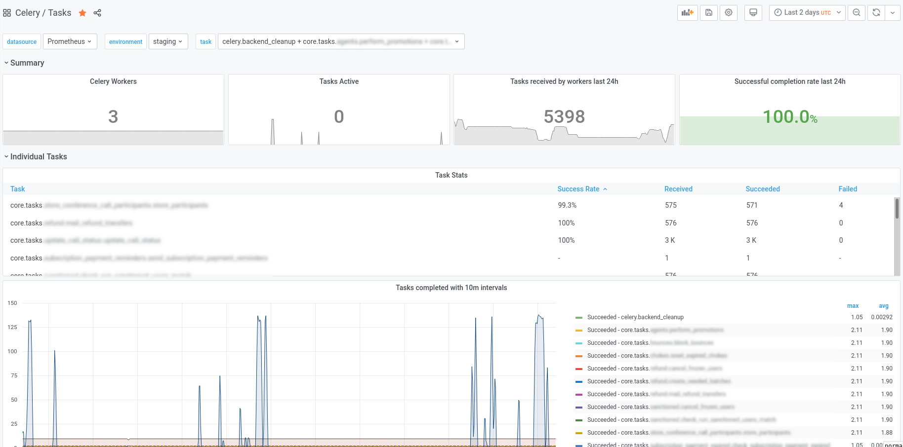

# celery-exporter [](https://ci.depode.com/danihodovic/celery-exporter)



##### Table of Contents

* [Why another exporter?](#why-another-exporter)
  * [Features](#features)
* [Usage](#usage)
  * [Enable events using the CLI](#enable-events-using-the-cli)
  * [Running the exporter](#running-the-exporter)
* [Metrics](#metrics)

### Why another exporter?

While I was adding Celery monitoring to a client site I realized that the
existing brokers either didn't work, exposed incorrect metric values or didn't
expose the metrics I needed. So I wrote this exporter which essentially wraps
the built-in Celery monitoring API and exposes all of the event metrics to
Prometheus in real-time.

## Features

- Uses the built in [real-time monitoring component in Celery](https://docs.celeryproject.org/en/latest/userguide/monitoring.html#real-time-processing) to expose Prometheus metrics
- Tracks task status (task-started, task-succeeded, task-failed etc)
- Tracks which workers are running and the number of active tasks
- Follows the Prometheus exporter [best practises](https://prometheus.io/docs/instrumenting/writing_exporters/)
- Works with both Redis and RabbitMQ
- Deployed as a Docker image or Python single-file binary (via PyInstaller)
- Exposes a health check endpoint at /health
- Grafana dashboards provided by the Celery-mixin
- Prometheus alerts provided by the Celery-mixin

## Usage

Celery needs to be configured to send events to the broker which the exporter
will collect. You can either enable this via Celery configuration or via the
Celery CLI.

##### Enable events using the CLI

To enable events in the CLI run the below command. Note that by default it
doesn't send the `task-sent` event which needs to be [configured](https://docs.celeryproject.org/en/latest/userguide/configuration.html#std-setting-task_send_sent_event) in the
configuration. The other events work out of the box.

```sh
$ celery -A <myproject> control enable_events
```

**Enable events using the configuration:**

```python
# In celeryconfig.py
worker_send_task_events = True
task_send_sent_event = True
```

**Configuration in Django:**
```python
# In settings.py
CELERY_WORKER_SEND_TASK_EVENTS = True
CELERY_TASK_SEND_SENT_EVENT = True
```

##### Running the exporter

Using Docker:

```sh
docker run -p 9808:9808 danihodovic/celery-exporter --broker-url=redis://redis.service.consul/1
```

Using the Python binary (for-non Docker environments):
```sh
curl -L https://github.com/danihodovic/celery-exporter/releases/download/latest/celery-exporter -o ./celery-exporter
chmod+x ./celery-exporter
./celery-exporter --broker-url=redis://redis.service.consul/1
```

##### Grafana Dashboards & Prometheus Alerts

Head over to the [Celery-mixin in this subdirectory](https://github.com/danihodovic/celery-exporter/tree/master/celery-mixin) to generate rules and dashboards suited to your Prometheus setup.

### Metrics
Name     | Description | Type
---------|-------------|----
celery_task_sent_total | Sent when a task message is published. | Counter
celery_task_received_total | Sent when the worker receives a task. | Counter
celery_task_started_total | Sent just before the worker executes the task. | Counter
celery_task_succeeded_total | Sent if the task executed successfully. | Counter
celery_task_failed_total | Sent if the execution of the task failed. | Counter
celery_task_rejected_total | The task was rejected by the worker, possibly to be re-queued or moved to a dead letter queue. | Counter
celery_task_revoked_total | Sent if the task has been revoked. | Counter
celery_task_retried_total | Sent if the task failed, but will be retried in the future. | Counter
celery_worker_up | Indicates if a worker has recently sent a heartbeat. | Gauge
celery_worker_tasks_active | The number of tasks the worker is currently processing | Gauge
