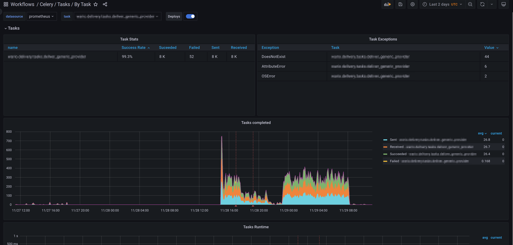

# celery-exporter  [](https://github.com/psf/black)



##### Table of Contents

* [Why another exporter?](#why-another-exporter)
  * [Features](#features)
* [Usage](#usage)
  * [Enable events using the CLI](#enable-events-using-the-cli)
  * [Running the exporter](#running-the-exporter)
* [Metrics](#metrics)
* [Development](#development)
* [Contributors](#contributors)

### Why another exporter?

While I was adding Celery monitoring to a client site I realized that the
existing brokers either didn't work, exposed incorrect metric values or didn't
expose the metrics I needed. So I wrote this exporter which essentially wraps
the built-in Celery monitoring API and exposes all of the event metrics to
Prometheus in real-time.

## Features

- Tested for both Redis and RabbitMQ
- Uses the built in [real-time monitoring component in Celery](https://docs.celeryproject.org/en/latest/userguide/monitoring.html#real-time-processing) to expose Prometheus metrics
- Tracks task status (task-started, task-succeeded, task-failed etc)
- Tracks which workers are running and the number of active tasks
- Follows the Prometheus exporter [best practises](https://prometheus.io/docs/instrumenting/writing_exporters/)
- Deployed as a Docker image or Python single-file binary (via PyInstaller)
- Exposes a health check endpoint at /health
- Grafana dashboards provided by the Celery-mixin
- Prometheus alerts provided by the Celery-mixin

## Dashboards and alerts

Alerting rules can be found [here](./celery-mixin/prometheus-alerts.yaml). By
default we alert if:

- A task failed in the last 10 minutes.
- No Celery workers are online.

Tweak these to suit your use-case.

The Grafana dashboard (seen in the image above) is
[here](https://grafana.com/grafana/dashboards/17508). You can import it
directly into your Grafana instance.

There's another Grafana dashboards that shows an overview of Celery tasks. An image can be found in `./images/celery-tasks-overview.png`. It can also be found
[here](https://grafana.com/grafana/dashboards/17509).

## Usage

Celery needs to be configured to send events to the broker which the exporter
will collect. You can either enable this via Celery configuration or via the
Celery CLI.

##### Enable events using the CLI

To enable events in the CLI run the below command. Note that by default it
doesn't send the `task-sent` event which needs to be [configured](https://docs.celeryproject.org/en/latest/userguide/configuration.html#std-setting-task_send_sent_event) in the
configuration. The other events work out of the box.

```sh
$ celery -A <myproject> control enable_events
```

**Enable events using the configuration:**

```python
# In celeryconfig.py
worker_send_task_events = True
task_send_sent_event = True
```

**Configuration in Django:**
```python
# In settings.py
CELERY_WORKER_SEND_TASK_EVENTS = True
CELERY_TASK_SEND_SENT_EVENT = True
```

##### Running the exporter

Using Docker:

```sh
docker run -p 9808:9808 danihodovic/celery-exporter --broker-url=redis://redis.service.consul/1
```

Using the Python binary (for-non Docker environments):
```sh
curl -L https://github.com/danihodovic/celery-exporter/releases/download/latest/celery-exporter -o ./celery-exporter
chmod+x ./celery-exporter
./celery-exporter --broker-url=redis://redis.service.consul/1
```

###### Kubernetes

There's a Helm in the directory `charts/celery-exporter` for deploying the Celery-exporter to Kubernetes using Helm.

###### Environment variables

All arguments can be specified using environment variables with a `CE_` prefix:

```sh
docker run -p 9808:9808 -e CE_BROKER_URL=redis://redis danihodovic/celery-exporter
```

###### Specifying optional broker transport options

While the default options may be fine for most cases,
there may be a need to specify optional broker transport options. This can be done by specifying
one or more --broker-transport-option parameters as follows:

```sh
docker run -p 9808:9808 danihodovic/celery-exporter --broker-url=redis://redis.service.consul/1 \
  --broker-transport-option global_keyprefix=danihodovic \
  --broker-transport-option visibility_timeout=7200
```

In case of extended transport options, such as `sentinel_kwargs` you can pass JSON string:,
for example:

```sh
docker run -p 9808:9808 danihodovic/celery-exporter --broker-url=sentinel://sentinel.service.consul/1 \
  --broker-transport-option master_name=my_master \
  --broker-transport-option sentinel_kwargs="{\"password\": \"sentinelpass\"}"
```

The list of available broker transport options can be found here:
https://docs.celeryq.dev/projects/kombu/en/stable/reference/kombu.transport.redis.html

###### Specifying an optional retry interval

By default, celery-exporter will raise an exception and exit if there
are any errors communicating with the broker. If preferred, one can
have the celery-exporter retry connecting to the broker after a certain
period of time in seconds via the `--retry-interval` parameter as follows:

```sh
docker run -p 9808:9808 danihodovic/celery-exporter --broker-url=redis://redis.service.consul/1 \
  --retry-interval=5
```

##### Grafana Dashboards & Prometheus Alerts

Head over to the [Celery-mixin in this subdirectory](https://github.com/danihodovic/celery-exporter/tree/master/celery-mixin) to generate rules and dashboards suited to your Prometheus setup.

### Metrics
Name     | Description | Type
---------|-------------|----
celery_task_sent_total | Sent when a task message is published. | Counter
celery_task_received_total | Sent when the worker receives a task. | Counter
celery_task_started_total | Sent just before the worker executes the task. | Counter
celery_task_succeeded_total | Sent if the task executed successfully. | Counter
celery_task_failed_total | Sent if the execution of the task failed. | Counter
celery_task_rejected_total | The task was rejected by the worker, possibly to be re-queued or moved to a dead letter queue. | Counter
celery_task_revoked_total | Sent if the task has been revoked. | Counter
celery_task_retried_total | Sent if the task failed, but will be retried in the future. | Counter
celery_worker_up | Indicates if a worker has recently sent a heartbeat. | Gauge
celery_worker_tasks_active | The number of tasks the worker is currently processing | Gauge
celery_task_runtime_bucket | Histogram of runtime measurements for each task | Histogram
celery_queue_length | The number of message in broker queue | Gauge
celery_active_consumer_count | The number of active consumer in broker queue **(Only work for [RabbitMQ and Qpid](https://qpid.apache.org/) broker, more details at [here](https://github.com/danihodovic/celery-exporter/pull/118#issuecomment-1169870481))** | Gauge
celery_active_worker_count | The number of active workers in broker queue | Gauge
celery_active_process_count | The number of active process in broker queue. Each worker may have more than one process. | Gauge

Used in production at [https://findwork.dev](https://findwork.dev) and [https://django.wtf](https://django.wtf).


## Development
Pull requests are welcome here!

To start developing run commands below to prepare your environment after the `git clone` command:
```shell
# Install dependencies and pre-commit hooks
poetry install
pre-commit install

# Test everything works fine
pre-commit run --all-files
docker-compose up -d
pytest --broker=memory      --log-level=DEBUG
pytest --broker=redis       --log-level=DEBUG
pytest --broker=rabbitmq    --log-level=DEBUG
```

## Contributors

<a href="https://github.com/danihodovic/celery-exporter/graphs/contributors">
  
</a>

Made with [contrib.rocks](https://contrib.rocks).
